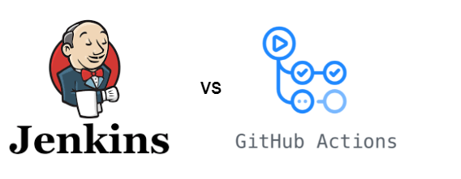
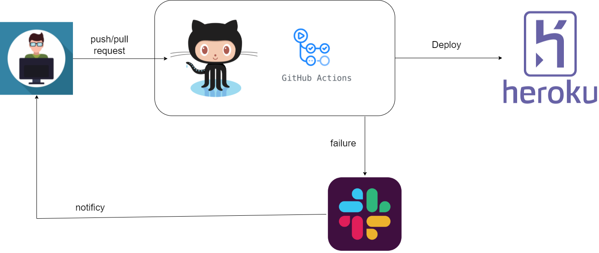
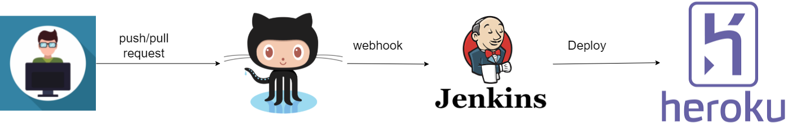

# Demo - Comparing two CI/CD tools: Jenkins vs Github Actions

A CI/CD Pipeline is a DevOps methodology which includes Continuous Integration, Continuous Delivery and Continuous Deployment.The benefits of applying these practices at the software developement process are huge that is why many companies apply them in our days. You can read more about it [here](https://www.digitalocean.com/community/tutorials/an-introduction-to-continuous-integration-delivery-and-deployment). 
A CI/CD Pipeline consists of some step that have to be  regularly executed. There are multiple tools that you can use to implement your own pipeline such as Jenkins, Github Actions, CircleCI, AWS CodeBuild, Azure DevOps, Atlassian Bamboo, or Travis CI. In this Demo, we will compare Jenkins with Github Actions. 
 
**Jenkins** is an open source automation server which enables developers around the world to reliably build, test, and deploy their software [1].
 
**GitHub Actions** is a continuous integration and continuous delivery (CI/CD) platform that allows you to automate your build, test, and deployment pipeline [2].
 

## 1. A Node.js server
For this Demo, we implemented a simple Node.js (Express.js) server which returns a JSON with a version (e.g. {version: "0.0.0"}) when a GET request is made to the "/".
A simple test was implemented which checks that the version has the expected format.

## 2. A CI/CD with Github Actions

### Description:
Three workflows have been implemented by just adding 3 yaml files under the .github/workflows directory at the Github repository.
The first one is called *onpull-request* and starts after a pull request at the main branch. It contains one job which builds and runs the tests. The second one is called *onpush* and starts after a push at the main branch. It builds, runs the tests and deploy the app on Heroku. 
The third one is called *slack-notify*. After one of the two flows is completed, the Slack Notification flow starts. This workflow contains only one job which will be triggered only if the first workflow has failed and will send a Slack message to notify the developers about the failure.
### The Pipeline:

### The App:
https://version-app.herokuapp.com/

### Run the demo

1. Clone or fork the repo
2. Create a Slack channel and a heroku app
4. Create two secrets (HEROKU_API_KEY, SLACK_WEBHOOK) and pass them as environment variables through the Github Settings.

## 2. A CI/CD with Jenkins
### Description:
The first step was to create a VM on Google Cloud and set up the Jenkins server on that machine. After that, we had to create a Multibranch pipeline [3] from the Jenkins UI and a Jenkinsfile inside the Github repository [4]. The Jenkinsfile has 4 stages (Prebuild, Build, Test and Deploy). When we push or do a pull request the pipeline is triggered and the steps at these stages run. However, the Deploy stage runs only when we push at the main branch. All these are executed at a docker container.
### The Pipeline:

### The App: 
https://version-app-jenkins.herokuapp.com/

### Run the demo
After creating a heroku app, follow the **Setup Jenkins** to install the necessary plugins and and integrate Jenkins with Github. 

### Setup Jenkins

In order to setup Jenkins, follow the official [tutorial](https://www.jenkins.io/doc/book/installing/ ) on how to do it for various platforms
we installed it for Linux on a Google Cloud VM. The host for Jenkins must be an Internet accessible host if you want to use Github webhooks. You
can however still setup Jenkins locally and poll the SCM or setup tunneling with [ngrok](https://ngrok.com/). Make sure to install the suggested 
plugins

#### Installing Jenkins Plugins

Before configuring the pipeline, you need to install the appropriate plugins. For our Jenkinsfile we need the [Github](https://plugins.jenkins.io/github/) and the [Docker](https://plugins.jenkins.io/docker-plugin/) plugins ([Installing plugins](https://www.jenkins.io/doc/book/managing/plugins/)). 

Once you have set up Jenkins click on New Item on the left menu. From there select Pipeline or Multibranch Pipeline (if you want to run builds
on multiple branches, such as staging and prod). In the General section, select GitHub project and add your GitHub project url (Not with the .git suffix) and your credentials (now a Token with whatever username). On the Build Triggers section select "GitHub hook trigger for GITScm polling" if you want to use GitHub webhooks, otherwise select Poll SCM to periodically check for changes or don't select anything if you only want to run the builds manually.

Finally on the Pipeline section, select "Pipeline script from SCM". Afterwards, select Git as the SCM and add the GitHub project URL. On the "Branches to build" section write "remotes/origin/main". This instructs Jenkins to only build the main branch. Add Jenkinsfile to the script path as that is the pipeline file we use in this repo.

#### Setting up webhook integrations

Finally to set up webhook integrations follow the first section of this [tutorial](https://www.blazemeter.com/blog/how-to-integrate-your-github-repository-to-your-jenkins-project).

## Comparison

1. **Maintenance**: Jenkins deployments are typically self-hosted, with users maintaining the servers in their own data centers. GitHub Actions offers a hybrid cloud approach by hosting its own runners that you can use to run jobs, while also supporting self-hosted runners [5].

2. **Cost**: Jenkins is open source and free while Github Actions is “Freemium”. However, both have costs because the cost of managing Jenkins on the cloud is not negligible.

3. **Ease of use**: Github Actions is easier compared to Jenkins. Especially, for beginners. 

4. **Flexibility**: With Github Actions you are tied to Github as a Source Code Management (SCM) system. Using Jenkins you can use any SCM such as Gitlab, BitBucket etc.

## References
1. [Jenkins (software)](https://en.wikipedia.org/wiki/Jenkins_(software))
2. [Understanding GitHub Actions](https://docs.github.com/en/actions/learn-github-actions/understanding-github-actions)
3. [Branches and Pull Requests](https://www.jenkins.io/doc/book/pipeline/multibranch/#:~:text=The%20Multibranch%20Pipeline%20project%20type,a%20Jenkinsfile%20in%20source%20control.)
4. [Using a Jenkinsfile ](https://www.jenkins.io/doc/book/pipeline/jenkinsfile/)
5. [Migrating from Jenkins to GitHub Actions](https://docs.github.com/en/actions/migrating-to-github-actions/migrating-from-jenkins-to-github-actions)
